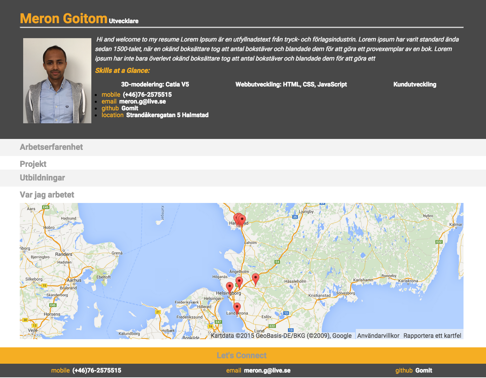

Project Name:
===============================
###My Resume

Description
===============================

My repository includes the following files:
* **index.html**: The main HTML document. Contains links to all of the CSS and JS resources needed to render the resume, including resumeBuilder.js.
* **js/helper.js**: Contains helper code needed to format the resume and build the map. It also has a few function shells for additional functionality. 
* **js/jQuery.js**: The jQuery library.
* **css/style.css**: Contains all of the CSS needed to style the page.
* **README.md**: The GitHub readme file.
* and some images in the images directory.

Credits:
===============================
###Based on [Udacity.com](https://www.udacity.com/course/front-end-web-developer-nanodegree--nd001), [JavaScript Basics](https://www.udacity.com/courses/ud804) and [Intro to jQuery](https://www.udacity.com/courses/ud245).
